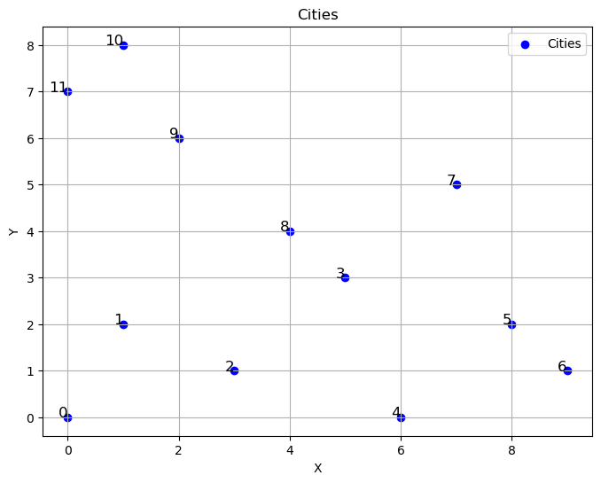
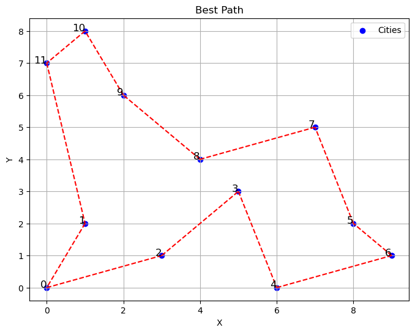

欄位 | 內容
-----|--------
爬山演算法 |參考 https://github.com/ccc112b/py2cs/blob/master/03-%E4%BA%BA%E5%B7%A5%E6%99%BA%E6%85%A7/02-%E5%84%AA%E5%8C%96%E7%AE%97%E6%B3%95/01-%E5%82%B3%E7%B5%B1%E5%84%AA%E5%8C%96%E6%96%B9%E6%B3%95/01-%E5%84%AA%E5%8C%96/01-%E7%88%AC%E5%B1%B1%E6%BC%94%E7%AE%97%E6%B3%95/04-%E7%88%AC%E5%B1%B1%E7%89%A9%E4%BB%B6%E5%B0%8E%E5%90%91%E6%A

程式空架 |參考chatgpt

以上內容皆參考後理解並重新打一次
##以下為不錯的解

首先生成12個城市位置分別在[0, 0], [1, 2], [3, 1], [5, 3], [6, 0], [8, 2], [9, 1], [7, 5], [4, 4], [2, 6], [1, 8], [0, 7]

使用使用 matplotlib 庫繪製路線

